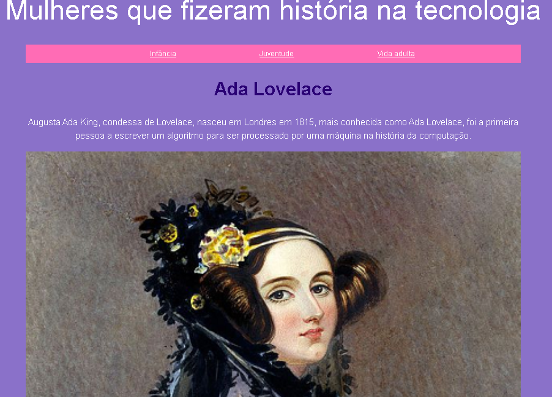

# Site Ada 👩🏻‍💻 
---
<div align="center">
## Acesso Rápido:
https://siteada--gabiqrm.repl.co/
</div>
---
<p align="center">
   
</p>

<div align="center">

[](https://github.com/gabiqrm/SiteAda)<space> <space>[](https://github.com/gabiqrm/SiteAda/blob/master/LICENSE)<space> <space>[](https://github.com/gabiqrm/SiteAda/)

</div>

---
## 📋 Sobre:

Site criado durante o curso Eu Progr{amo} disponibilizado pela Progra{m}aria inspirado na história de Ada Lovelace e outras mulheres que fizeram história na tecnologia.

---
## ⚙️ Tecnologias:

```bash
📍 HTML5
📍 CSS3
📍 JavaScript
```

##  Execução:
1. Clonar via prompt de comando o projeto em uma pasta de sua preferência:
```bash
$ git clone https://github.com/gabiqrm/SiteAda.git
```
2. Acessar a pasta principal do projeto via prompt de comando:
```bash
$ cd SiteAda
```
3. Na pasta raiz, executar o arquivo: `index.html`


---
## 🔗 Contribuições:
```
- Faça o fork do projeto (https://github.com/gabiqrm/SiteAda.git)
- Crie uma branch para sua modificação (git checkout -b feature/[nome])
- Faça o commit (git commit -am 'Add files [nome]')
- Push (git push origin feature/[nome])
- Crie um novo Pull Request
```

---
## 🔐 Licença:
Esse projeto está sob a licença MIT. Veja o arquivo [LICENSE](LICENSE) para mais detalhes.

---

## 👩🏻‍💻 Desenvolvedora:

Desenvolvido por Gabriela Queiroz ! 💜
